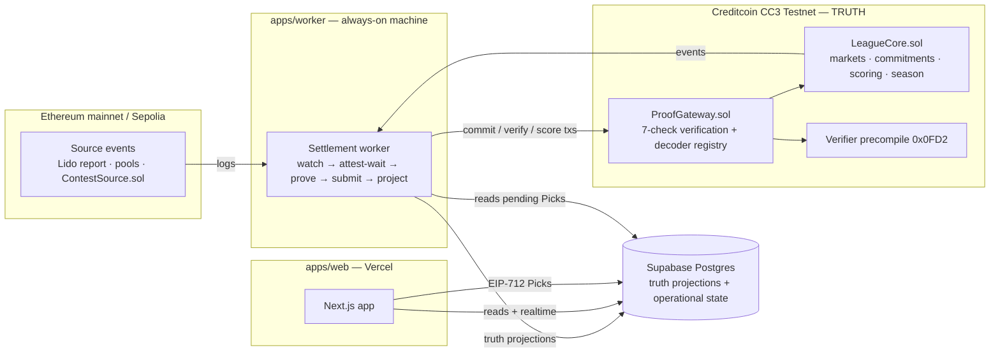
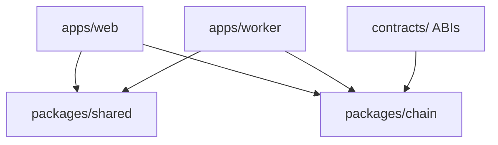
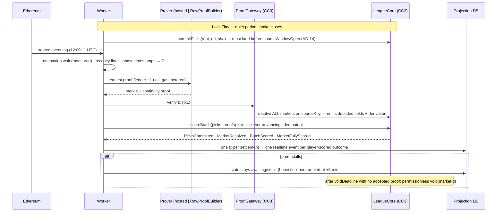

# Architecture Spine — Proof League

> **Canonical with revision.** Read with `FIDELITY-ARCHITECTURE-REVISION.md`; AD-22..36, its revised structural seed and §11 delivery posture win on conflict while AD-1..21 remain in force. The planning files remain a requirements catalog; development is Plan-mode-led and repo-native, not a BMad build workflow. Tests are supporting checks, never a separate deliverable (NFR-11).

## Design Paradigm

**CQRS over an on-chain event store.** All writes of truth are Creditcoin transactions (market creation, pick commitments, resolution, scoring, payouts); the chain is the event store. Postgres holds two declared classes of projection (AD-18): **truth projections** rebuildable from chain + published pick-sets, and **operational state** that is never an input to truth. The web app is a window and a pick collector, never a computer of outcomes. Plane → directory mapping: `contracts/` (truth), `apps/worker/` (the only submitter of transactions and sole writer of truth projections), `apps/web/` (reads + signed-pick intake into operational state), `packages/` (shared types, chain config, ABIs, the canonical encodings).



## Invariants & Rules

### AD-1 — The chain is the only writer of truth
- **Binds:** all (esp. FR-12..15, NFR-1, NFR-5)
- **Prevents:** the web tier computing outcomes; the projection becoming a second source of truth; silent admin edits.
- **Rule:** market resolution, scoring, streak/season math and payouts exist only as `LeagueCore` state transitions. Every **truth-class** displayed number (AD-18) must be reproducible by `pnpm rebuild` from chain events + published pick-sets; exactly three values are authoritative off-chain and excluded: display name, a Pick's pre-lock draft state, and operational observations (AD-18 class 2). No settled/correct state renders before its on-chain transaction is confirmed.

### AD-2 — Three planes, one dependency direction, one write exception
- **Binds:** all
- **Prevents:** circular dependencies; two pick-intake implementations; the worker becoming a hard dependency of onboarding.
- **Rule:** `apps/web` and `apps/worker` import only from `packages/*`; `packages/*` import nothing from apps; nothing imports from `apps/web`. The worker is the sole submitter of transactions and the sole writer of **truth-class** tables. `apps/web` owns exactly one write path: EIP-712 Pick intake into the `pending_picks` table (class-2), via Next.js route handlers, before Lock Time — signature validation and canonical encoding come from `packages/shared`, so both planes share one implementation. The worker has no inbound HTTP except `/health`. Consequence, stated: **a worker outage stops settlement but never stops pick intake.** Enforced by `eslint no-restricted-imports` zones.



### AD-3 — Two Creditcoin contracts; a Market exists on-chain, immutably, before it opens
- **Binds:** FR-4..7, FR-13, FR-19, FR-21; FR-6's structural consequence
- **Prevents:** contract sprawl; the operator moving option boundaries after the event; two minters of `marketId`; absence-shaped or post-horizon markets being representable.
- **Rule:** exactly `LeagueCore.sol` and `ProofGateway.sol` on Creditcoin, plus `ContestSource.sol` (shape-parameterized, so the Mainnet-Read-Gate fallback needs configs, not new contracts) on Sepolia. `LeagueCore.createMarket(config)` is the **sole minter of `marketId`**, which is the only Market key anywhere (contracts, DB, APIs, URLs). The on-chain config is the authority and carries: source `chain` + chainKey, emitter, event signature, subject filter, `decoderId`, ordered Outcome Option boundaries (2–6), Payout N, `leagueDay`, `lockTime`, `sourceWindowOpen`, `voidDeadline`, decode-feasibility attestation (admission checklist §5 incl. the decode-gas gate) — written before the Market opens, immutable thereafter; a Market renders nowhere and accepts no Picks until `MarketCreated` confirms. The config schema makes FR-6 rules 3–4 unrepresentable (no absence predicates; `lockTime` must precede a required `determinismHorizon`). `packages/shared` holds schema + copy (question text, explainers) only. New Markets within a decoder family are config; a new source-event *shape* is a new decoder registered append-only in `ProofGateway`'s `decoderRegistry` (never repointed, never redeploying LeagueCore).

### AD-4 — Verify, resolve and score are separate, and the chain owns the fan-out
- **Binds:** FR-13, FR-14, FR-15; decode-gas ceiling
- **Prevents:** unbounded-loop DoS; a worker-chosen market list deciding what settles; one scalar answer mis-resolving two markets.
- **Rule:** tx1 = `ProofGateway.verify(proof)` → on success it resolves **every** unresolved Market in `LeagueCore.marketsBySourceKey[sourceKey]` (an index built at Market creation — the caller supplies no market list); each Market applies its own `decoderId`, derivation and boundaries to the decoded payload independently. `[review 2026-08-31]` The fan-out loop **skips, never reverts on**, siblings not in state `Committed` (voided or never-committed markets on the key can never block the settle), and when more than one valid source event could match a `sourceKey` inside its window, **the first accepted proof wins** — stated on the transparency page, so caller timing is a race everyone can see, not a hidden chooser. `resolve` **emits the decoded fields and derivation inputs** per market, so the proof view and `pnpm rebuild` are honest (the seven checks render green statically, justified because verification reverts on any failure — stated, not faked). Scoring runs separately as `LeagueCore.scoreBatch(marketId, Pick[] picks, bytes32[][] proofs)`: permissionless, leaves verified against the committed root, advancing a **contract-held cursor** — `[review 2026-08-31]` batches must be **contiguous**: `require(batchStartIndex == cursor)`, cursor advances by the batch length, so skip-ahead can never strand intermediate players' Picks; below-cursor leaves rejected, fully-scored markets no-op, `MarketFullyScored` emitted exactly once. Batch size from the day-1 gas measurement. Negative tests cover repeated, interleaved, and skip-ahead calls plus the voided-sibling fan-out.

### AD-5 — Picks are signed off-chain, committed as a merkle root, provably player-authored and canonical
- **Binds:** FR-8..10; UJ-1
- **Prevents:** operator-invented or operator-selected Picks; per-pick gas; unverifiable pick-sets.
- **Rule:** Picks are EIP-712 messages carrying `(player, marketId, optionIndex, stake, nonce, utcDay, stakedSoFarInDay)`; **latest nonce wins**, cancellation is a signed zero-stake tombstone. The canonical leaf encoding is defined once as `abi.encode` in `LeagueCore`, mirrored in `packages/shared` via a single viem-based `hashPick()`, with a Solidity↔TS conformance fixture in CI (ethers v6 is RPC-only in the worker). The published pick-set JSON contains every Pick **with its signature**, sorted `(player asc, nonce asc)` — the ordering is part of the commitment. Publication is content-addressed and dual-homed: Supabase Storage at a write-once public path `picksets/<marketId>-<sha256>.json` **and** `docs/pick-sets/` in the public repo (CI-committed same day); the sha256 goes on-chain in `commitPicks`. `pnpm rebuild` re-verifies every signature, the budget rule (AD-15), and the root.

### AD-6 — Chain identity is data, resolved at runtime, and bound on-chain where it decides truth
- **Binds:** all chain interactions; check 2
- **Prevents:** the per-environment chainKey footgun; a Sepolia event proving a mainnet market (cross-chain spoof).
- **Rule:** `packages/chain/networks.ts` is the single module for chain ids, chainKeys, RPC + proof-builder endpoints, **explorer base URLs**, and contract addresses; chainKeys are read from the ChainInfo precompile (`0x…0fd3`) at worker boot (a client concern — the precompile is not on the contract path). The Market's expected source chainKey is **on-chain config** (AD-3), never calldata: check 2 reads "it came from the right contract **on the right chain**." Literal chainKeys anywhere else fail `eslint no-restricted-syntax`.

### AD-7 — The proof budget is a managed ledger; correctness outranks budget
- **Binds:** FR-12, FR-14, NFR-1 > NFR-3
- **Prevents:** running dry mid-demo; silent skips; single-vendor proving dependency.
- **Rule:** the worker's persistent ledger meters **both proof units and CTC gas** across the 3 funded worker accounts (creation + commits + proofs + scoring + voids all draw gas; prize escrow lives in a fourth account the ledger never touches), with low-water alarms to the operator webhook at a three-day-traffic threshold and a **balance probe in the liveness cron** (funding is a manual daily Discord duty during the unattended window — an accepted, named operational duty; pre-fund maximally before Sep 6). Targets: settle within [day-1 measured attestation + 5 min] (FR-12 acceptance); proofs submit ≤ 60 min after the source event (cost cliff), respecting the protocol's **recency floor** (rule, not diagram annotation). At T+45 min unattested: alert and prove anyway when possible — **NFR-1 over NFR-3** — marked over-cliff on the transparency log. One accepted proof settles all markets on its `sourceKey` (one budget unit); looping multiple verifies per tx is a documented, unused budget lever. Proving is an interface: hosted Proof Builder primary, **`RawProofBuilder` local fallback (same interface)** wired and rehearsed — `[review 2026-08-31]` "rehearsed" is a named drill during the history window: block the hosted prover for one round (RawProofBuilder settles it), restart the worker mid-pipeline (cursors resume without re-detection), force the ledger below threshold (alert fires, markets render `stuck`) — results logged in `docs/`. Budget exhaustion or prover outage renders affected markets `stuck` with the honest reason — never a silent skip, never an unproven settlement. `[review 2026-08-31]` Every pipeline phase runs under a **per-phase timeout with a watchdog** — a hung RPC call can never wedge the re-entrancy-guarded loop — and `/health` exposes the last-loop-tick age so the external liveness probe detects a wedged worker that cannot alert for itself. Pick-set publication is **upload-both-homes, verify-readable, then `commitPicks`** — never commit first — so a failed upload can never strand committed picks unprovable. Phase timestamps (event / attested / proven) are written to the transparency projection **as each phase completes**, feeding the live pipeline UI.

### AD-8 — Postgres truth projections are provably rebuildable; one settlement, one transaction, one event
- **Binds:** FR-15, FR-17, FR-19; AD-1
- **Prevents:** DB drift; the UJ-2 reveal showing points without streak/rank.
- **Rule:** truth-class tables are keyed by chain identifiers; `pnpm rebuild` reproduces them exactly and the diff runs in CI **on every push** and before submission. The projector applies one settlement as a single Postgres transaction across score/streak/rank tables and emits **one realtime event per player-scored outcome** — the Proof Reveal for a Player triggers on *their Pick scored*, never on bare market resolution, so the choreography runs whole. Contract redeploys are followed by `pnpm rebuild` before the app serves. Leaderboard renders ≤1 s at 200 rows (seeded test); log and history paginate — no infinite scroll.

### AD-9 — Wallet-light auth; the address is the identity of record; the fallback changes the claim
- **Binds:** FR-1, FR-3, FR-8; AD-5's trust story
- **Prevents:** seed-phrase ceremony; identity splits; custody theatre.
- **Rule:** Privy embedded wallets; Creditcoin CC3 Testnet is a **built-in `viem/chains` definition** (`creditCoin3Testnet`), passed via `supportedChains` — the day-1.5 spike tests the narrow question: does the embedded wallet sign our EIP-712 Pick **without a visible prompt**. The Player's EVM address is the identity of record everywhere; auth-identity → address is 1:1 and immutable for the Season (address rotation unsupported in v1; instability = spike failure → fallback, not schema workaround). Fallback (pre-decided): passkey/WebAuthn-backed signing first; app-managed keys only as last resort — and that branch **changes the public claim**: transparency page + Integration Summary must state that commit-before-knowability (AD-14), not player signatures, then carries the integrity story. Operator/admin surface uses separate credentialed auth (never Privy player auth), reaches only the powers enumerated in AD-20.

### AD-10 — Realtime is Broadcast-push; one clock decides everything
- **Binds:** FR-4, NFR-2, NFR-6; EXPERIENCE time language
- **Prevents:** reload-driven UI; three clocks disagreeing about Lock Time.
- **Rule:** projection changes reach clients via **Supabase Realtime Broadcast** (`realtime.broadcast_changes()` from triggers; fallback 5 s polling) within 10 s. **Creditcoin chain-head time is the only clock that decides anything**; `apps/web`'s `/time` endpoint serves it (with age), and every countdown, intake check and worker trigger derives from it. Client countdown flips are display predictions only — the intake API is the lock authority. The measured expected-settlement window is served to clients so "running long" evaluates honestly.

### AD-11 — Hosted Round outcomes are fixed by a pre-committed block, influenceable by nobody
- **Binds:** FR-21; UJ-4; the "untouched by us" claim
- **Prevents:** the operator choosing outcomes; **any caller** grinding entropy by timing `settle()`.
- **Rule:** `ContestSource` fixes `settleBlock` (a Sepolia block ≥ the scheduled settle time) at round creation, before Lock Time. `settle(roundId)` is permissionless after `settleBlock` is mined, reverts before it, and derives the outcome exclusively from `blockhash(settleBlock)` + parameters fixed at creation — identical result regardless of caller or timing. The worker calls within the 256-block horizon; a lapsed horizon voids the round. Transparency copy: "nobody — operator or player — can influence this outcome." `[ACCEPTED by Abu 2026-08-27]` Hosted Round v1 outcomes are therefore verifiable randomness, not skill — honest for the demo path, with the copy law: Hosted Rounds are always presented as a provably-fair luck round, never as skill; skill-based contest sources are a post-v1 upgrade of `ContestSource`, not of this invariant.

### AD-12 — Build in the open; the repo is the evidence store; upstream is watched, not trusted
- **Binds:** NFR-7, SM-3, NFR-4
- **Prevents:** end-window dump; dependency drift landing mid-judging; submission fields forgotten.
- **Rule:** one public pnpm monorepo from day 1, **MIT license** [Abu's OQ4 default]; `docs/` carries the research reports, the Integration Summary, spike measurements, and pick-set mirrors — `[review 2026-08-31]` pick-set mirrors commit to a **dedicated data branch** exempt from the Sep-4 protection (bot-authored; the data-vs-code commit policy stated in the README), so daily evidence commits through Sep 18 never read as post-freeze development. Conventional commits pushed daily. CI on every push: `forge test` (all seven negative settlement tests + no-privileged-path + scoring idempotence), typecheck, the AD-8 rebuild diff, and the EIP-712 conformance fixture — `[review 2026-08-31]` **main CI is green from the first commit**: the fixture ships green with a trivial self-test vector, is armed with the real Solidity↔TS vectors in the commitment story, and carries a **mutation check** (perturb one field → hash mismatch → CI fails) proving the gate can actually go red. A scheduled **upstream watch** re-checks `@gluwa/*` versions, `gluwa/creditcoin3` releases, and proof-builder/faucet reachability. Sep 6–18: `[review 2026-08-31]` the liveness cron runs on an **external scheduler (GitHub Actions cron), never on the worker host it monitors**, and alerts on a **missing heartbeat**, not only failed probes. It probes: Today, one market page, the transparency page, a signed test-pick round-trip against the permanently open probe Hosted Round (probe design per Story 5.3: nonce-replacement of one standing 10-point pick, round flagged out-of-lineup so it never renders on player surfaces or feeds the Leaderboard), worker `/health` last-loop-tick age, worker-account balances, **market supply** (≥ the next 48 h of scheduled instances AND, for boundary-static Series, coverage through Sep 18 — shortfall alerts, because Today's empty state looks healthy while the product dies), and **a Hosted Round reaching `proof verified` within the last 48 h** (NFR-4's end-to-end re-verification, not just a signed pick) — every 15 min, alerting the operator webhook; posture: zero upstream support — blocked dependencies are routed around, never waited on. **Sep 4 code freeze** (branch protection); Sep 4–6 reserved for the submission bundle: demo video, five-pillar deck, Integration Summary, README, sector + bios — and the final upload IS the entry.

### AD-13 — One environment, one deployment, evidence over infrastructure
- **Binds:** NFR-4, NFR-5; AD-8
- **Prevents:** Vercel previews polluting the committed pick-set; unrecoverable worker restarts; redeploy chaos.
- **Rule:** exactly one live environment. Web on Vercel (production branch only; previews run against a scratch Supabase project, never production keys — `[review 2026-08-31]` enforced, not hoped: a zod boot refinement refuses to boot when `VERCEL_ENV == 'preview'` and the database/Supabase refs are not the scratch project, closing the one-mis-scoped-env-var path to preview picks polluting the committed pick-set); worker on one always-on machine `[ASSUMPTION: Fly.io — payment method attached day 1; any always-on Node host satisfies]`; Supabase provisioned with **new-format API keys** day 1. One deployment each of LeagueCore/ProofGateway (CC3) and ContestSource (Sepolia); calendar guidance (Abu 2026-08-27): earlier redeploys are routine development (AD-8), and the **one-deployment history window ≈ Sep 1–5** is when SM-2's ≥10 real settlements accrue on one stable deployment, the league running for real daily. The worker persists per-market pipeline cursors (restart = resume, not re-detect) and alerts at expected-settlement + 5 min (FR-12). RLS: all truth projections public-read (`anon` select); `pending_picks` insert/update only by the owning wallet before Lock Time; no deletes; the service key exists only in the worker. Secrets in Vercel/Fly stores, testnet value only; nothing requires a secret to read.

### AD-14 — Commitment precedes knowability, and the chain enforces it
- **Binds:** FR-9, NFR-1, NFR-5; AD-5
- **Prevents:** post-hoc pick insertion — the judge's "what stops you adding a winning pick after the report lands?"
- **Rule:** `commitPicks` reverts unless `block.timestamp ∈ [lockTime, sourceWindowOpen)` (both on-chain, fixed at creation; `[review 2026-08-31]` `createMarket` and `instantiateNext` require `sourceWindowOpen ≥ lockTime + MIN_COMMIT_MARGIN` — a named shared constant — so an empty or unusably thin commit window is unrepresentable); `resolve` requires state `Committed`. A Market whose commitment missed its window can never resolve — it voids with full stake return (AD-19's Created branch). `[review 2026-08-31]` A Market reaching `lockTime` with zero live Picks commits the **canonical empty root** — the lifecycle proceeds normally and `scoreBatch` no-ops straight to `MarketFullyScored`; zero-pick markets never rot uncommitted. Pick intake closes at `lockTime − INTAKE_QUIET_PERIOD` (named constant ≥ 60 s); the snapshot boundary (last accepted intake sequence) is recorded in the pick-set file, and RLS enforces the same cutoff (`lockTime − INTAKE_QUIET_PERIOD`, not `lockTime`) so nothing can slip in behind the snapshot; the worker retries clock-skew reverts until `sourceWindowOpen`. A Pick's UI status is `pending` until `PicksCommitted` confirms and it is provably in the published set (the only Pick-state word); after commit the UI reconciles pending Picks against the published set and surfaces any orphan honestly.

### AD-15 — The daily allowance is signed, re-verified at commit, and capped again on-chain
- **Binds:** FR-8, FR-15; AD-1, AD-5
- **Prevents:** the intake API becoming unaudited truth; over-budget staking minting Season Points.
- **Rule:** each Pick's signed message carries `utcDay` and cumulative `stakedSoFarInDay` (≤ 100). The worker re-verifies the whole day's set immediately before `commitPicks` — `[review 2026-08-31]` the check is **sum of live stakes per signed `utcDay` ≤ 100** (tombstones and replaced nonces excluded), never a monotonic-consistency check on `stakedSoFarInDay` snapshots, so cancels/edits/voids that lower spend can never make a valid day uncommittable — a budget-breaching set is never committed. `LeagueCore` keeps `dailySpent[player][utcDay]` and at scoring **skips** (never reverts on) over-budget Picks, `[review 2026-08-31]` selecting skips deterministically by the signed nonce order within the player's `utcDay` — never by cross-market scoring order, so no caller's batch timing chooses which stake pays. The remaining-points meter is class-2 provisional display. `[review 2026-08-31]` Allowance accounting is keyed **entirely by the Pick's signed `utcDay`**: debits and void returns hit the same key (streaks use the Market's `leagueDay` per AD-16 — two different questions, two different keys, stated). A still-live `utcDay` regains spending power on void; a closed one records the return without granting it ("your points were not spent"), and voided Picks never count toward streak aggregates.

### AD-16 — Scoring, streaks and days are deterministic aggregates
- **Binds:** FR-15, FR-18, FR-19; AD-4
- **Prevents:** scoring order or hostile callers deciding streaks; midnight-boundary attacks; stuck markets freezing the spine.
- **Rule:** a Pick's day is its Market's immutable `leagueDay`, never any transaction's timestamp. `LeagueCore` keeps per-player-per-day `{picksCount, correctCount, marketsPending}`; a day's streak contribution evaluates only at `marketsPending == 0` (correct>0 extends; picks>0 ∧ correct==0 breaks; picks==0 pauses) — order-independent, reproducible. `[review 2026-08-31]` The streak value is a **fold over finalized days in `leagueDay` order, recomputed on every day-finalization** — never an increment on finalization arrival order — so a provisional day N−1 finalizing (or breaking) after day N has already finalized still yields the correct streak and tie-break key. Days containing a stuck Market are **provisional**: shown with a marker, excluded from all-time-best until final; the streak animation fires on day finalization. `[PRD amendment — accepted by Abu 2026-08-27]` FR-15 gains this provisional-day carve-out; FR-19's tie-break becomes `(Season Points desc, current Streak desc, earliest commitment-appearance asc, address asc)` — `[review 2026-08-31]` "earliest commitment appearance" is defined precisely as **the minimum commit ordinal among the player's scored Picks** (what the chain can actually record — voided/unscored picks never surface on-chain; PRD Assumption 10 aligned), the Leaderboard sorts by the contract-recorded value only (rebuild asserts equality), and `address asc` is the final total-order key so no two players can ever tie — chain-derivable end to end, replacing off-chain signup date.

### AD-17 — Season settlement is claim-based, on-chain-keyed, and segregated
- **Binds:** FR-19, FR-20, NFR-3, NFR-4
- **Prevents:** an unbounded payout loop; Leaderboard and payout disagreeing; pool CTC draining the proof budget.
- **Rule:** Season parameters (`seasonEnd` Sep 17, pool, 50/30/20) are set in `LeagueCore` at Season start, immutable, funded from the segregated escrow account (`[review 2026-08-31]` funding is a **one-time manual step on the final pre-window deployment checklist**; earlier development deploys initialize `pool = 0` and the banner honestly renders chain state — iteration is never throttled by funding ceremony). After `seasonEnd`, `payoutSeason()` is permissionless and **claim-based**: any address submits a candidate top-3; the contract verifies ordering against its own state in O(3), opens a challenge window, pays on expiry. `[review 2026-08-31]` Hardenings from the close-out review: (1) **claims are accepted only once every Market with `leagueDay ≤ seasonEnd` is terminal** (`Resolved | Voided`) — standings can never change after payout; negative test: claim while any season market non-terminal. (2) The challenge window is the named shared constant `SEASON_CHALLENGE_WINDOW` (6 h — long enough for the automated watcher, short enough to pay before judging ends). (3) Payment is **pull-based**: expiry credits claimable balances and winners withdraw individually, so one reverting recipient can never block the payout. (4) Splits are defined for **0/1/2 eligible winners** (unfilled shares return to escrow). (5) The worker **watches candidate submissions and auto-submits the superior candidate** inside the window, sends the expiry call itself, and webhooks the operator on any revert — with the permissionless fallback documented on the transparency page so anyone (including Abu on a phone) can drive it. (6) The execution path is testable before Sep 17: `verify:payout` deploys a minutes-long test Season on the same bytecode and drives trigger→claim→challenge→pay end-to-end; a post-`seasonEnd` cron asserts the payout transaction exists on-chain, else alerts. No loop over players on-chain; the Leaderboard sorts by exactly the on-chain keys (AD-16). No operator action required — it executes inside the unattended window by design.

### AD-18 — Two classes of projection state
- **Binds:** FR-5, FR-7, FR-8, FR-17; AD-1, AD-8
- **Prevents:** the rebuild diff being quietly weakened; observations masquerading as proofs.
- **Rule:** every table is declared **class 1 (truth)** — markets, committed Picks, resolutions, scores, Season Points, streaks, payouts — or **class 2 (operational)** — pending Picks, pre-lock distribution, watcher cursors, budget ledger, phase-timestamp observations. Class 1 rebuilds exactly (CI, every push). Class 2 never feeds a class-1 value and is labelled *observed, not proven* where displayed (the transparency log's event/attested columns carry the note; the proven column links the Creditcoin transaction that IS proven). Derived display states (`awaiting attestation`, `stuck`) are pure functions of (class-1 state, Market config, chain time), defined once in `packages/shared`.

### AD-19 — Void is a guarded, terminal, permissionless timeout; stuck is a rendering
- **Binds:** FR-7, NFR-1; AD-14
- **Prevents:** the operator as judge; voiding markets whose event exists; double-settlement after void.
- **Rule:** `void(marketId)` is permissionless; reverts unless `block.timestamp > voidDeadline` ∧ state ∈ {`Created`, `Committed`} — `[review 2026-09-03]` the earlier third conjunct ("no accepted proof for the `sourceKey`") is **not** implemented as a per-key read, because it can never fire honestly: resolution happens only inside `verify()`, atomically with the key's acceptance, so a market the accepted proof settled is already terminal to the state check — while a Committed sibling the fan-out *skipped* (pre-open window, unreadable decoder) sits on a consumed key (first-accepted-proof-wins), can never resolve again, and gating its void on `acceptedAt` would freeze it in `Committed` forever: the exact eternal-freeze class this AD exists to kill, and a permanent deadlock of AD-17's all-terminal payout gate. Eligibility is therefore a pure function of (state, chain clock), which is also the stronger judge-facing claim: every admitted market has a reachable terminal state — before the deadline it may resolve, after it anyone can void, nothing can block both. Both halves are pinned by test (resolved-market void reverts; skipped-sibling-on-consumed-key void succeeds). `[review 2026-08-31]` the `Created` branch makes AD-14's promise real: a Market whose commitment missed its window (or was never committed) is voidable past its deadline instead of frozen forever; stake return applies only to the committed case (Created markets hold no stakes). `voidDeadline` (default 24 h post-window) must exceed any plausible proving stall — the void clock is never the shorter one. Void is terminal (`resolve` permanently reverts after it). There is **no privileged void**. `[review 2026-08-31]` The worker's loop carries the duty: for every eligible market past `voidDeadline`, it submits `void()` itself (permissionless, so anyone else can too) — void is never waiting on a human during the unattended window. `stuck` is not a chain state: it is the projection's rendering of *committed, past expected settlement, before voidDeadline*; `[review 2026-08-31]` the derived-state function additionally renders *past `voidDeadline`, void not yet mined* as `stuck` (void-pending reason) so no window of on-chain state lacks a chip. LeagueCore's state machine is exactly `Created → Committed → Resolved | Voided`, monotone, with `Created → Voided` now a legal edge.

### AD-20 — No privileged path to an outcome
- **Binds:** NFR-1, NFR-5; every judge-facing claim
- **Prevents:** the 2 a.m. `adminResolve()`; upgradeability laundering the same power.
- **Rule:** LeagueCore and ProofGateway are non-upgradeable and expose no owner path that can resolve, re-resolve, void, score, or alter any committed pick, boundary, payout or season parameter. Operator power is exhaustively: register Series and create markets before they open (AD-21), fund escrow, schedule Hosted Rounds, register decoders (append-only). The remedy for a broken market is redeploy + rebuild (AD-13). A negative test asserts no privileged caller reaches settled state.

### AD-21 — The Market Engine: Series mint markets; nobody posts them by hand
- **Binds:** FR-4, FR-6, FR-12; NFR-3, NFR-4; AD-3, AD-7, AD-20
- **Prevents:** manual daily market posting (a human single-point-of-failure through Sep 18); a buggy or compromised worker draining the proof budget via creation; operator discretion at open time; schedule gaps during the unattended window.
- **Rule:** recurring Markets belong to an on-chain **Series** — an immutable template in LeagueCore carrying source chain + emitter + event signature, `decoderId`, cadence, boundary *formula*, lock/window/void offsets, and a **`maxInstancesPerDay` cap enforced by the contract** (the proof-budget guard lives on-chain, never worker-side). `instantiateNext(seriesId)` is **permissionless**: anyone may mint the next due instance, and every per-instance parameter (`leagueDay`, `lockTime`, `sourceWindowOpen`, `voidDeadline`, boundaries) is **derived by the registered formula — chosen by nobody**. `[review 2026-08-31]` Formula inputs are pinned to make that claim verifiable: observations are **chain-resident decoded fields emitted by prior resolved instances** (AD-4 already emits them), read over the slot's deterministic window (e.g. last N resolutions before `slotStart`) — never call-time state, never an off-chain feed — so two callers at different times mint **byte-identical parameters** (negative-tested), and `pnpm rebuild` recomputes `formula(on-chain observations)` and diffs it against each instance's stored boundaries. A slot whose derived `lockTime` has already passed is **skipped, not minted** (the series cursor advances past dead slots; born-locked markets are unrepresentable). The worker's scheduler is merely the caller of record and maintains a **48–72 h rolling buffer** of pre-created Markets, so an outage delays nothing already scheduled. `[review 2026-08-31]` Judging-window policy: only **boundary-static Series** (Hosted Rounds) pre-extend through Sep 18 before the freeze; **observation-derived Series keep the rolling 48–72 h horizon through the judging window** — boundary freshness beats pre-creation, because week-old boundaries on a drifting metric make options foregone conclusions (FR-6 rule 1) — with the external liveness scheduler as backup `instantiateNext` caller (it is permissionless) and a market-supply probe alerting on shortfall (AD-12). One-off Markets (launch specials) remain direct `createMarket` under FR-6 admission. AI may draft Series templates **at authoring time only** — Abu reviews, the reviewed config registers; nothing generates market parameters unattended (post-v1 seam: community/AI proposals + stake/review, per the creator-self-serve deferral). Rejected alternatives, recorded: fully permissionless creation (malformed/spam markets are a documented failure mode — SoK arXiv:2510.15612 — and here a direct DoS on the ~27-proof/day budget); operator bad-config void (Azuro's clause would reintroduce a privileged path — AD-19 already voids unsettleable configs honestly). Scale seam: if instance count ever outgrows per-market writes, commit a merkle root of the day's configs (Overtime-V2 pattern) — documented, not built. Trust posture exceeds the field's: Azuro's data provider both creates and resolves; here creation is formula-bound and resolution comes only from proofs — a judge-facing claim for the Integration Summary. Provenance: event-catalog research (cadences, keeper, race framing); market-engine recon 2026-08-27 (Azuro / Polymarket series / Overtime / Reality.eth templates; archived in `research/reference-teardowns-2026-08-27/`).

## Consistency Conventions

| Concern | Convention |
| --- | --- |
| Naming | PRD Glossary verbatim in code: `Market`, `Pick`, `PickPoints`, `SeasonPoints`, `Card`, `Settlement`. Glossary "Settlement Contract" = the LeagueCore+ProofGateway suite; "Referee" = that suite plus the verifier path. Judge-facing copy writes **Attestcoin Protocol**; code imports stay `usc-*` (expected, per research). Solidity events past-tense; files kebab-case; components PascalCase. |
| Ids & keys | `uint256 marketId` (minted only by `createMarket`) is the sole Market key everywhere. Players keyed by lowercased wallet address. Card serial = `(marketId, player)` rendered as `N° <marketId>-<pickIndex>`. Integer base units; yields 1e18 fixed-point (≥12 decimals). |
| State machine ↔ chips | Contract states: `Created · Committed · Resolved · Voided` (monotone). Display chips, verbatim from EXPERIENCE plus one addition: `open` · `locked` · `committed` · `awaiting attestation` · `proof verified` · `voided` · `stuck` — the state-chip component is the single renderer; "settled" stays a Glossary noun, never a chip. Pick state: `pending` only (AD-14). |
| Canonical lists | The seven checks live once in `packages/shared` and feed focused contract verification names, the proof panel, the transparency page, and the Integration Summary. Payout/points math lives once in `packages/shared`, mirrored by the smallest focused contract checks needed (the composer preview is display of that shared function, not a second implementation). Design tokens single-sourced from `REFERENCE-DESIGN.md`; the state→light-channel mapping is colocated with the state chip. |
| Time | UTC everywhere; ISO-8601 in APIs; chain-head time is the deciding clock (AD-10); expected-settlement copy from the day-1 measured figure via the one shared util, served to clients. |
| Web reads & a11y | Landing/logged-out surfaces render from cached server components (revalidate ≤ 30 s) hitting the ≤3 s Fast-4G floor; Realtime upgrades in place. WCAG 2.2 AA: state never color-alone, `aria-live="polite"` on settlement transitions, tabular numerals, `prefers-reduced-motion` honored; a11y checks ride the judge-rehearsal script. Share images render via an `opengraph-image` route (Node runtime, cached by Card id), settled data only. |
| Config & secrets | zod-validated env at boot; secrets only in platform stores; testnet value only; reading requires no secret. |
| Contracts | Solidity **0.8.28 exact**; `evm_version` pinned in `foundry.toml` to the day-1-spike-confirmed target (Blockscout verification depends on it). OZ **exactly 5.1.0 — vendor-mandated by `@gluwa/usc-contracts@0.2.0`'s exact dependency; do not bump to 5.6.x**. Decoder/verifier imports ONLY from `@gluwa/usc-contracts/contracts/write-ability/common/` (the other `INativeQueryVerifier.sol` lacks `verifyAndEmit`). Security-critical state-changing paths receive focused negative/fuzz/invariant checks inside the implementing slice. |
| Delivery verification | Product behavior is the deliverable. No testing epic, coverage target or broad UI automation suite. Use check/build, the rebuild proof, focused contract/signing checks and direct browser inspection of the real desktop/mobile flows per NFR-11. |

## Stack

| Name | Version | Note |
| --- | --- | --- |
| Solidity toolchain | Foundry v1.2.3 (pinned) | re-confirm at kickoff |
| solc | 0.8.28 exact | evm_version per day-1 spike |
| @gluwa/usc-contracts | 0.2.0 exact | verified latest 2026-08-23 |
| @gluwa/usc-sdk | 0.18.0 exact | consumed only by the worker's prover client |
| @openzeppelin/contracts | 5.1.0 exact | vendor-mandated — do not bump |
| ethers | 6.17.x | worker RPC only |
| viem | 2.55.x | EIP-712 hashing + `creditCoin3Testnet` chain def |
| Web | Next.js 16.3.x (App Router) · Tailwind 4.3.x · shadcn/ui (CLI 4.19.x) | init on/after the 2026-08-26 security release |
| Auth/wallet | Privy `@privy-io/react-auth` 3.37.x | free tier covers hackathon scale |
| DB / realtime | Supabase Postgres + Realtime **Broadcast** · Drizzle ORM 0.45.x / drizzle-kit 0.31.x | do not adopt the v1 RC; new-format API keys |
| Worker runtime | Node 24 (Active LTS) + TypeScript · Fly.io always-on `[ASSUMPTION]` | `.nvmrc` = Fly image = CI; payment method day 1 |
| Package manager | pnpm 11.x via `packageManager` field | |
| Chains | Creditcoin CC3 Testnet (102031) · Ethereum Sepolia · mainnet reads behind the Mainnet-Read Gate | the Gate is a data/config fork, never a code fork |

## Structural Seed

```text
proof-league/
  contracts/            # Foundry: LeagueCore, ProofGateway (+ decoderRegistry), ContestSource; negative-test suite
  apps/
    web/                # Next.js: Landing, Today, Market, Leaderboard, Profile, Transparency, admin/ (operator auth), api/picks, api/time, opengraph-image
    worker/             # daemon: series scheduler (AD-21), watchers, attest-wait, prover client (hosted + RawProofBuilder), submitter, projector, budget+gas ledger (no inbound HTTP except /health)
  packages/
    shared/             # glossary types, EIP-712 pick schema + hashPick (viem), seven-checks list, payout math, market-config schema, derived-state fns, time util
    chain/              # networks.ts (runtime chainKeys, RPCs, prover endpoints, explorer bases), ABIs, addresses
  docs/                 # research, Integration Summary, spike measurements, pick-set mirrors
```



## Capability → Architecture Map

| Capability | Lives in | Governed by |
| --- | --- | --- |
| FR-1..3 onboarding/profile | apps/web + Privy | AD-9, AD-10 |
| FR-4..7 markets & states | LeagueCore config + packages/shared copy + apps/web | AD-3, AD-6, AD-18, AD-19, conventions |
| FR-8..10 picks & cards | apps/web intake → pending_picks → worker commit | AD-2, AD-5, AD-14, AD-15 |
| FR-11 sharing | apps/web opengraph-image route (cached, settled data only) | AD-1, conventions (web reads) |
| FR-12 worker pipeline | apps/worker | AD-7, AD-13 |
| FR-13/14 verify + fan-out | ProofGateway + LeagueCore | AD-4, AD-6, AD-20 |
| FR-15 scoring | LeagueCore scoreBatch + projector | AD-4, AD-8, AD-16 |
| FR-16/17 proof views & transparency | apps/web + resolve event surface + phase timestamps | AD-4, AD-18, conventions (canonical lists) |
| FR-18/19 streaks & leaderboard | LeagueCore aggregates + projection | AD-16, AD-8 |
| FR-20 season & payout | LeagueCore escrow + payoutSeason() | AD-17, AD-20 |
| FR-21 hosted rounds | ContestSource + apps/web admin/ | AD-11, AD-3, AD-9 (operator auth) |
| NFR-1 correctness | everywhere | AD-1, AD-14, AD-19, AD-20 |
| NFR-2 latency honesty | shared time util + phase timestamps | AD-7, AD-10, conventions |
| NFR-3 proof budget | worker ledger | AD-7, AD-17 (segregation) |
| NFR-4 judging window | cron + worker + payout design | AD-12, AD-13, AD-17 |
| NFR-5 security posture | contracts + secrets | AD-20, AD-13, conventions |
| NFR-6 performance | web reads + Broadcast | AD-10, conventions |
| NFR-7 build-in-open | repo + CI | AD-12 |

## Execution Seed — Day-1 Spike (opening act, gates everything)

Results land in `docs/spike-day1.md` + the memlog; a failed gate updates this spine the same day:
1. **Funding & provisioning** — on-chain CTC balances of 3 worker accounts + the escrow account; Fly payment method attached; Supabase project on new-format keys.
2. **hello-bridge end-to-end** — measure attestation wall-clock **and** the recency floor; measured figures replace every placeholder (FR-12, NFR-2, UX copy).
3. **Mainnet-Read Gate probe** — `getSupportedChains()` live; a failed gate changes market *data* (source chain fields + watcher endpoints), never code.
4. **Decode-gas headroom** — decode a real Lido `TokenRebased` receipt; sets `scoreBatch` size and the decode-feasibility admission threshold.
5. **Privy × Creditcoin smoke test** — embedded wallet signs the EIP-712 Pick without a visible prompt (day 1.5).
6. **EVM target** — deploy a trivial contract to CC3; confirm the `evm_version` that verifies on creditcoin-testnet.blockscout.com.

**Calendar (guidance, not gates — Abu 2026-08-27; only the submission facts are hard):** day-1 spike Aug 28 → build with normal iteration — redeploys are routine development (AD-8's rebuild makes them cheap; their only real cost is resetting judge-visible settlement history) → **one-deployment history window ≈ Sep 1–5**: the league runs for real daily on a stable deployment so SM-2 evidence accrues (≥4/5 clean settlement days; ≥10 real settlements — Sep 1–5 × 2 Lido Markets/day is exactly 10 with zero misses, so **Hosted Rounds run daily from Sep 1 as settlement top-up**; the landing's real settled Card accrues here) → **Sep 4 code freeze** → Sep 4–6 submission bundle → **Sep 6 23:59 ET upload = entry (hard)** → Sep 6–18 unattended judging. Cut order (PRD §6.1) maps to: FR-20/FR-19/FR-11/Pool-Race/second-Lido are UI + config cuts — the full contract surface (escrow, scoring, season, Series) should be deployed before the history window opens, so cutting never reopens contracts.

## Deferred

- **Snapshot Keeper + Curve/base-fee markets** — P2; admission rules (AD-3) and the decoder registry are the seams; decide ~Sep 1.
- **Creator self-serve** — post-v1; data-driven `createMarket` is the seam.
- **Skill-based Hosted Round sources** — post-v1 upgrade of `ContestSource` behind the same AD-11 integrity property (randomness-v1 accepted by Abu 2026-08-27).
- **ERC-721 export, sybil, notifications, mobile optimization** — PRD non-goals/deferrals.
- **Mainnet topology** — post-hackathon; AD-6's runtime resolution + the config `chain` field are the seams.
- **Lido bucket boundaries & race windows** — market-config data at the pre-launch re-sample; option-count 2–6 already schema-supported.
