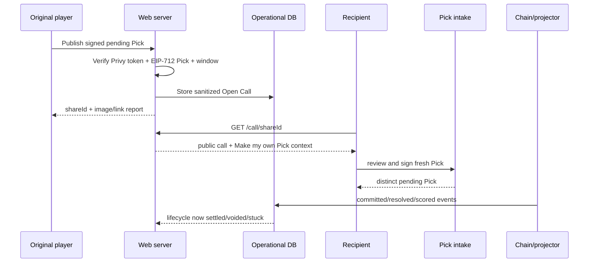
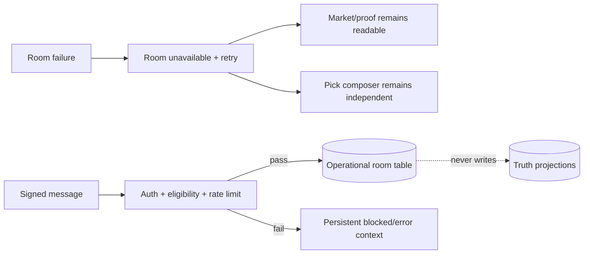
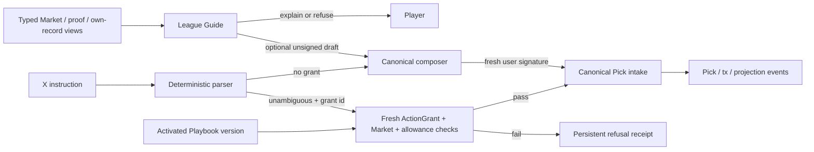

# Architecture Revision — Product, Social and Responsive Planes

## 1. Change boundary

AD-1..21 remain in force. This revision adds AD-22..36 and replaces the Structural Seed/Capability Map only where the new product requirements need explicit homes. AD-30/31 are read/projection additions. AD-32/33/34 are product-horizon authority surfaces that require new contract/security gates; they do not silently weaken the existing Pick, proof, scoring, admission or on-chain authority model. AD-36 makes product identity and overlay behavior shared infrastructure rather than page-level polish.

Social and reference-fidelity features are operational/read-model state. They must never become a second truth plane.

## 2. New architecture decisions

### AD-22 — One responsive app, one route model

Desktop and mobile render the same routes, domain functions and submission flows. Responsive components may change composition (two-column ticket vs sheet/bottom action) but not capability. A phone redirect, separate mobile domain or desktop-only gate is forbidden.

### AD-23 — Server shell, client islands

Next.js App Router route groups organize public, product, account and operator layouts without changing URLs. Pages/layouts remain Server Components by default. Client boundaries are limited to auth, theme, realtime, composer, Reels gestures, Room composer and share APIs. Each route owns `loading.tsx`, `error.tsx` and, where relevant, `not-found.tsx`.

### AD-24 — Social state is Class 2 and locally degradable

`shared_calls`, `challenges`, `market_room_messages`, `message_reports` and attribution rows are Class-2 operational state. They may reference canonical `marketId`, player address and Pick identity, but cannot update or derive Market outcome, score, Streak, rank or proof acceptance. Failure renders a local unavailable state; it never blocks canonical reading or Pick submission.

### AD-25 — Publishing a call is an explicit signed act

Pending Picks remain private. Publishing creates a sanitized, immutable call snapshot only after the server:

1. verifies the Privy access token and maps it to the embedded wallet address;
2. verifies the EIP-712 Pick signature and current pending Pick identity;
3. verifies the Market is still within the allowed publication window;
4. stores the exact public fields plus the Pick signature/hash reference and expiry.

Unlisting changes discoverability, not the permanent Pick/Card. At commitment/settlement the projector links the share to canonical events and advances its public lifecycle; the web never invents the settled state.

### AD-26 — Copy means context, never authority

Share/Challenge URLs carry opaque ids only. The server resolves them to validated structured context. “Make my own Pick” creates a fresh draft and fresh EIP-712 signature with the receiver's address, nonce and allowance. No signature, wallet session, nonce or authorization from the originator is reused.

### AD-27 — Market Rooms are signed conversation, not truth

Reading is public. Posting requires Privy server authentication plus a signed room-message payload and eligibility against a valid pending/committed Pick for `marketId`. Messages are append-only; moderation adds report/hidden metadata without rewriting text. Server time orders messages. RLS/private Broadcast authorizes participant channels, but the public read path comes from paginated server queries.

### AD-28 — Share images are deterministic render products

Open and settled 4:5 images and 1.91:1 OG images consume the same validated `ShareCardViewModel`. The model has a discriminated union (`open | settled | voided | stuck`) whose fields make false combinations unrepresentable. Image routes use the Node runtime, pinned fonts/assets owned by Proof League, stable caching keys and no remote user HTML/images.

### AD-29 — Creator Studio cannot bypass admission

The v1 Challenge builder references only existing Markets. A future Series proposal writes an operational draft and runs source/decoder compatibility checks. Only the existing operator/on-chain Series registration path can create a truth-bearing template. Creator approval is never settlement authority.

### AD-30 — League Guide is a typed read-model consumer

League Guide receives a versioned `GuideContext` assembled from canonical Market/proof/own-record view models. It cannot import database clients, chain writers, Pick intake, call publication or grant services. Model output is untrusted text plus an optional validated `PickIntentDraft`; the only way to act is to open the canonical composer, where ordinary eligibility, allowance, timing and EIP-712 confirmation run again.

The model runs server-side behind a provider interface. Credentials never enter the browser. Missing credential, refusal, rate limit and upstream failure are normal discriminated states; the contextual dock/meter and manual product still render. Conversation is session-local by default. Persistent memory requires a later privacy/retention decision and is not smuggled in through wallet identifiers.

### AD-31 — Player Edge and Proof Surface are rebuildable projections

Player Edge derives from the same complete Card/scoring event projection used by Record and League. Proof Surface derives from canonical Market/source/commitment/attestation/proof/score events. Neither owns truth and neither may estimate a missing result. Each reading carries sample/window, completeness, `asOf`, stale/error status and provenance.

The projector computes reusable metric records; pages do not recalculate domain metrics independently. A rebuild-diff gate compares both projections against chain/event history. Incomplete pagination or source outage produces partial/stale/unavailable, never a zero value presented as complete.

### AD-32 — Combo is a new on-chain commitment, not a UI grouping

A canonical Combo requires a dedicated audited contract surface (`ComboBook` or a proven equivalent), because grouping ordinary client-side Picks cannot honestly promise a combined return or atomic earliest-lock rule.

The contract stores a hash of ordered immutable legs, points, combined multiplier cap, void policy, owner and earliest intake cutoff. It verifies that every leg references an admitted Market, no leg is already knowable, daily allowance remains within the same cap and the deterministic return is bounded. Leg terminal events advance an idempotent cursor; any caller may continue finalization after safe deadlines. Combo scoring emits enough data to rebuild the exact receipt and must not reopen or hand-edit settled ordinary Picks.

### AD-33 — Delegated external intents use one on-chain Action Grant boundary

X and automated Playbooks cannot reuse the manual EIP-712 Pick signature later, and an off-chain database flag is not wallet authority. Full execution therefore requires an owner-signed/on-chain-verifiable `ActionGrant` or account-abstraction policy with equivalent guarantees:

- fixed owner/player beneficiary and executor;
- capability (`X_PICK` or `PLAYBOOK_PICK`), allowed Market/Series scope and action kind;
- maximum points per Pick/day, expiry and revocation nonce;
- no withdrawal, transfer, call publication, Market creation, proof, score or grant-widening authority.

The isolated executor has one writer and nonce queue. Ingestion produces an immutable `ExternalIntent`; deterministic parsing either refuses or yields a validated Pick draft. Current Market/allowance/cutoff/grant policy is checked immediately before submission. `ExecutionReceipt` distinguishes refused, submitted, confirmation-unknown and accepted with instruction, grant, Pick and tx ids. Before this contract/security gate exists, X/Playbook flows stop at an ordinary prefilled draft.

### AD-34 — Playbooks are versioned policy, Agents are runners

`PlaybookDefinition` is Class-2 authored policy with immutable published versions. Simulation reads labeled historical projections and cannot write Picks or be mixed with live performance. An Agent activation binds exactly one published version to one AD-33 grant and isolated runner session. Updating a Playbook never mutates an active version or widens an existing grant.

Agent comparison uses complete live execution/score receipts, including misses, voids, failures and inactive periods. AI can draft/explain policy but cannot activate a runner, manufacture evidence or make a settlement decision.

### AD-35 — Takes and notifications are isolated distribution planes

Takes are signed Class-2 content keyed to canonical Market/Call ids. Notifications consume canonical outbox events plus user consent/preferences; they never infer proof/score from elapsed time. Delivery workers are idempotent and write attempt/provider receipt status separately from the canonical event.

Feed or notification failure is local. Unsubscribe/revocation stops future external sends without deleting Activity/Record truth. Reels may interleave Takes through a presentation adapter but still uses the bounded real-Market cursor and cannot substitute social popularity for Market admission/order.

### AD-36 — Visual identity and overlays are typed shared systems

Known asset, chain, protocol, provider and assistant identities resolve through one typed `MarkRegistry`. Each entry records the canonical key, accessible name, local owned/approved asset, permitted color/monochrome modes, provenance and trademark/license note. BTC, ETH/Ethereum, Creditcoin/Attestcoin and X may not fall back to initials or unrelated generic symbols. Unknown keys return a neutral category glyph plus full visible name. Player identity is a deterministic address identicon or approved user image; the Guide uses an owned Proof League mark.

One `OverlayCoordinator` owns `idle | tooltip | teaser | onboarding | auth | guide | share | report | composerReview`. Tooltip/teaser states are non-blocking. At most one blocking overlay exists, and a handoff closes the origin while carrying a validated context object to the destination. Focus return, Escape/back rules, intent retention, reduced-motion suppression and mobile safe-area clearance live in this state model rather than being reimplemented per route. Toasts are outside the blocking stack, capped at one and cannot own critical state.

Guide invitation timing is feature-owned configuration: first appearance 3.5 s, hold 4.8 s, gap 4.5 s and three total pops. Its ring reads real lifecycle timing; open, session-dismissed and reduced-motion states suppress the sequence. Action cards remain impossible until a schema-valid non-failure answer exists and they can only hand off to the canonical composer.

## 3. Data ownership and schemas

All tables remain owned by `packages/shared/db/` and migrations/RLS stay in the same package.

| Table | Class | Essential fields | Writer | Truth relationship |
|---|---|---|---|---|
| `shared_calls` | 2 | `share_id`, `market_id`, `player`, `pick_hash`, public option/stake snapshot, `status`, `expires_at`, `unlisted_at`, timestamps | authenticated web route; projector advances lifecycle | References a verified signed Pick; settled fields come only from projection joins/events |
| `challenges` | 2 | `challenge_id`, `market_id`, creator, title, prompt, status, timestamps | authenticated web route | Cannot modify Market config or lifecycle |
| `challenge_joins` | 2 | challenge/share attribution, joining player, resulting Pick hash, timestamps | pick intake after a real signed Pick | Analytics only; never scoring |
| `market_room_messages` | 2 | id, market id, player, body, signed payload hash/signature, eligibility snapshot, server timestamp, moderation status | authenticated route | Conversation only |
| `message_reports` | 2 | reporter, message, reason code, timestamp | authenticated route | Moderation only |
| `user_preferences` | 2 | wallet, theme, tutorial version, optional notification capability | authenticated route | Convenience; theme may also have local versioned cache |
| `takes` | 2 | take id, Market/Call id, author, signed body hash/signature, moderation state, timestamps | authenticated route | Opinion only; never source/outcome evidence |
| `notification_preferences` | 2 | player, channel verification, consent version, quiet hours, event controls | authenticated route | Delivery authority only |
| `notification_deliveries` | 2 | canonical event id, preference/channel, idempotency key, attempt/provider receipt/status | notification worker | Cannot originate a canonical lifecycle event |
| `guide_feedback` | 2 | optional session-safe response id, rating/reason, no raw secret/context | authenticated route | Quality feedback only; no truth/memory authority |
| `player_edge_projection` | 1 projection | player, window/sample/completeness, segment metrics, source cursor, `as_of` | worker projector | Rebuildable from complete Card/scoring events |
| `proof_surface_projection` | 1 projection | source/Series/window, lifecycle counts/latencies, completeness, cursor, `as_of` | worker projector | Rebuildable from canonical pipeline events |
| `combo_projection` | 1 projection | Combo id/hash, owner, immutable legs, points/cap/void policy, leg cursor, terminal result | chain events via projector | Canonical only after AD-32 contract exists |
| `action_grants` | 1 projection | grant id/hash, owner, executor, capability/scope/caps/expiry/revocation nonce | chain/account-policy events | Canonical delegated authority after AD-33 gate |
| `external_intents` | 2 | provider/instruction id, linked account, parse result/refusal, grant id, idempotency key | X/Agent ingestion | Instruction evidence; not authority by itself |
| `execution_receipts` | 2 + chain references | intent/grant/Pick/tx ids, submitted/unknown/accepted/refused state, timestamps | isolated executor/projector | Cannot claim acceptance before canonical receipt/event |
| `playbook_definitions` | 2 | creator, immutable version/hash, readable rules, status, simulation metadata | authenticated studio | Authored policy only |
| `agent_activations` | 2 + grant reference | owner, playbook version, grant id, runner status, timestamps | authenticated route/runner | Bound by AD-33 grant; no independent authority |
| existing Markets/Picks/Cards/Settlements/projections | 1 | unchanged | chain events via worker projector | Canonical truth |

RLS and API rules:

- Class-1 truth projections: public read, worker service-role write only.
- `shared_calls`/`challenges`: public read when listed; owner insert/unlist; no client-written settled/outcome fields.
- Room messages: public server read; authenticated eligible insert through a server route; direct table update/delete denied.
- Reports/preferences: owner read/write as appropriate.
- Takes: public listed read; signed author insert; moderation hides discovery without rewriting truth-bearing records.
- Notification workers read consented outbox events only; provider delivery rows cannot update Market/Pick/proof/score projections.
- Guide routes receive allow-listed typed snapshots and cannot import writer/grant credentials. Raw prompt/provider logs must not contain wallet secrets or unpublished Pick signatures.
- External intents and Agent activations may reference a grant, but only current on-chain/account-policy verification authorizes execution.
- Every mutating server route verifies Privy access tokens server-side; client `authenticated` state is never authorization.

## 4. Updated structural seed

```text
proof-league/
  contracts/                         # existing core unchanged; extensions are contract-gated
    src/
      LeagueCore.sol
      ProofGateway.sol
      ContestSource.sol
      extensions/                    # product-horizon only after spike/security approval
        ComboBook.sol
        ActionGrantRegistry.sol
  apps/
    web/
      app/
        (public)/
          page.tsx                   # editorial landing
          call/[shareId]/
          challenge/[challengeId]/
          player/[address]/
          proof/[settlementId]/
          how-proof-works/
          status/
          social/
          surface/
        (product)/
          markets/
          market/[marketId]/
          reels/
          create/
          league/
          record/
            page.tsx
            edge/
          combo/
          playbooks/
          agents/
          trade-from-x/
        (account)/
          activity/
          settings/
        (operator)/admin/hosted-rounds/
        api/
          picks/
          calls/
          challenges/
          rooms/[marketId]/
          share-images/
          guide/
          takes/
          notifications/
          external-intents/
          playbooks/
          time/
      components/
        ui/                           # themed base primitives; registry provenance recorded
        shell/                        # desktop header, mobile bottom nav, More/account
        market/                       # board, hero, option rows, canonical composer adapters
        reels/                        # presentation only; imports market composer
        record/                       # Card/Call/settled record
        room/                         # list, composer, local error boundary
        share/                        # sheet, preview and native/download/X fallbacks
        onboarding/                   # versioned primer and return-to-intent
        guide/                         # contextual read surface; no writer imports
        identity/                      # marks, address identicons, provenance-aware renderers
        overlays/                      # tooltip/teaser/blocking-overlay coordinator
        edge/                          # complete own-record explanation
        combo/                         # leg builder/preview/receipt
        takes/ notifications/          # isolated distribution surfaces
        external-intents/ playbooks/ agents/ surface/
      features/
        auth/ calls/ challenges/ markets/ picks/ rooms/ share/ theme/
        guide/ edge/ combo/ takes/ notifications/ grants/ external-intents/ playbooks/ agents/ surface/
        identity/ overlays/
        # each feature: schema.ts, service.ts, view-model.ts, errors.ts; focused checks only where useful
      lib/                            # server-only auth/db/config; formatting and route-safe helpers
    worker/
      src/
        scheduler/ pipeline/ ledger/ projector/ loop.ts
        projectors/share-lifecycle.ts # chain-event derived call lifecycle only
        projectors/player-edge.ts
        projectors/proof-surface.ts
        projectors/combo.ts
        notifications/ external-intents/ agents/
  packages/
    shared/
      db/                             # all schemas/migrations/RLS including social Class 2
      domain/                         # Pick/Market/Card/Settlement/Challenge/Share contracts
      flows/                          # pure state/report models
      copy/                           # canonical state/error/check text
    chain/                            # unchanged config/ABI/address ownership
    design-tokens/                    # CSS-variable contract, typography and share-image tokens
      marks/                           # typed mark manifest; no runtime remote icon fetch
    policy/                           # ActionGrant/Playbook/notification policy schemas; no provider clients
  docs/
    provenance/assets.md              # source, license/trademark and allowed variants per mark
```

The split follows the official Next.js rule that route groups organize layouts without changing URLs and underscore-prefixed private folders can safely colocate non-routable implementation. Route handlers are thin HTTP adapters; route-specific presentation stays near the route, while cross-route domain logic stays outside `app/` and has no `next/*` imports. Secret-bearing modules begin with `import "server-only"`.

## 5. Canonical adapters

One adapter per protocol/product boundary:

| Adapter | Input | Output / promise |
|---|---|---|
| `AuthIdentityAdapter` | Privy verified claims | canonical lowercased player address; never trusts client identity |
| `PickIntakeAdapter` | draft + player + Market | signed pending Pick/report with `submitReached` |
| `MarketViewAdapter` | chain/projection rows | one canonical Market view model reused by board, Reels and detail |
| `CallPublicationAdapter` | verified pending Pick | sanitized immutable Open Call snapshot |
| `ShareLifecycleAdapter` | call + canonical events | discriminated open/settled/voided/stuck view model |
| `CopyContextAdapter` | share/challenge | validated new-draft defaults; no authority fields |
| `RoomEligibilityAdapter` | player + Market + pending/commit state | allowed/blocked reason, compile-complete copy map |
| `ThemeAdapter` | system + `pl.theme.v1` + server cookie | flash-free light/dark state |
| `GuideContextAdapter` | canonical Market/proof/own-record views | allow-listed versioned context with provenance/completeness; no writers/secrets |
| `GuideIntentAdapter` | untrusted model response | explanation/refusal plus optional validated unsigned `PickIntentDraft` |
| `PlayerEdgeAdapter` | complete Card/scoring projection | sample-aware segment report with partial/stale states |
| `ProofSurfaceAdapter` | canonical pipeline projection | source/Series/horizon health and latency view; unsupported finance fields impossible |
| `ComboIntakeAdapter` | ordered legs + points + owner | earliest-lock quote/validation and canonical AD-32 commitment/report |
| `ActionGrantAdapter` | owner policy/signature + current on-chain state | exact effective authority or typed expired/revoked/out-of-scope/over-cap refusal |
| `ExternalIntentAdapter` | linked provider instruction | deterministic refusal or validated draft; never authority |
| `PlaybookAdapter` | immutable definition/version + readings | labeled simulation or draft; live action only through `ActionGrantAdapter` |
| `NotificationAdapter` | canonical outbox event + current consent | idempotent delivery intent with deep link; never a synthesized lifecycle claim |
| `VisualIdentityAdapter` | canonical asset/chain/protocol/provider/player key | approved local mark or neutral named fallback; never initials masquerading as a logo |
| `OverlayCoordinator` | origin, overlay kind and validated handoff context | one accessible overlay state with focus/intent return and no modal stacking |

## 6. Flow contracts

### Publish and copy



### Room isolation



### Guide, external intent and canonical intake



### Combo lifecycle

```text
draft legs
  -> validate admitted Markets + duplicate/knowability rules
  -> preview earliest cutoff + capped combined return + void policy
  -> owner EIP-712 confirmation
  -> on-chain Combo commitment
  -> per-leg terminal projection with cursor
  -> complete | voided | stuck | confirmation-unknown
  -> one rebuildable Combo Card/receipt
```

## 7. Error and recovery extension

Use the existing `Result<T,E>` and report-object law. Every social/share flow has:

- persistent red refusal/blocked context when the action is known not to have succeeded;
- retry context with the original draft retained;
- amber confirmation-unknown when a request may have reached the server, with share/message id when known;
- success only after the server returns the durable id;
- toast as supplementary feedback, never the only state.

No share/native API cancellation is described as publication failure when the durable link already exists. The report distinguishes `published` from `sharedExternally`.

Guide/provider failure keeps the prompt/draft and manual composer available. External-intent/Agent failure always keeps the immutable instruction id, grant id and last reached phase. A grant expiry/revocation is a known refusal, not a provider error. Combo partial settlement names completed/pending/voided legs and exposes permissionless continuation only when safe.

## 8. Implementation checks and boundaries

These checks support the feature that owns them; they are not a separate testing deliverable or UI automation programme:

- route inventory check: every user-facing route has its required loading/error/not-found states;
- import rule: Reels and Challenge builder must import the canonical Market/Pick adapters and may not define payout/availability/signing logic;
- database rule: Class-2 tables cannot be imported into score/settlement/Streak/leaderboard domain modules;
- compile-time exhaustive handling of `ShareCardViewModel` open/settled/voided/stuck variants;
- manual browser inspection at 1440×1000, 1024×768, 390×844 and 360×800 with overflow, focus and safe-area observations;
- focused exercise of Web Share native success/cancellation/unsupported, PNG download, copy link and popup-safe X intent;
- focused RLS checks for public read, owner mutation, eligible Room post and forbidden direct updates;
- raw source cap extends to CSS/SQL/config at 400 lines; TypeScript remains 300 effective lines.
- dependency/import rule: Guide code cannot import chain/domain writers; Surface/Edge pages cannot define metric formulas; X and Agents cannot bypass `ActionGrantAdapter` or the canonical Pick intake.
- server-boundary rule: auth/database/service-role, model-provider and executor credentials live only in `server-only` modules; build/lint fails if any browser dependency reaches them.
- one focused Guide grounding/refusal evaluation over missing/stale/contradictory typed snapshots; schema parsing proves invalid output cannot cross the unsigned-intent boundary, and the model receives no executable submit tool.
- targeted Combo contract fuzz/invariant checks for bounds, allowance, commit-before-knowability, void behavior and idempotent continuation before the feature claims live status.
- targeted Action Grant negative checks for owner/executor/beneficiary/scope/caps/expiry/revocation/replay/ambiguity before automated execution claims live status.
- one EIP-712 equality check pins `name`, `version`, `chainId`, `verifyingContract`, primary type and field order across contracts, viem signing and server verification.
- rebuild-diff observation for Player Edge and Proof Surface, including pagination caps, partial/stale readings and losses/voids/stuck coverage.
- focused notification consent/outbox exercise for unsubscribe, quiet hours, duplicate delivery and prohibition on pre-canonical settlement/score copy.
- manual live theme-toggle inspection for canvas/SVG/chart primitives in both directions; clean reload screenshots alone do not catch stale mounted colors.
- mark-registry completeness/provenance check plus manual confirmation that BTC, ETH/Ethereum, Creditcoin/Attestcoin, X, Guide and Player identity render the correct mark and accessible label.
- overlay-state inspection covers teaser cap/timing, one-blocking-overlay law, handoff, Escape/back, focus return, reduced motion and mobile nav clearance.

## 9. No-hardcoding and constants additions

New canonical homes:

- `TUTORIAL_VERSION`, `THEME_STORAGE_KEY`, `SHARE_IMAGE_SIZES`, `ROOM_BODY_LIMIT`, rate-limit policy and share expiry derivation live with their owning features.
- Route names/nav items live once in `components/shell/navigation.ts` as a typed table.
- Share statuses and Room error unions live in shared domain modules with complete copy maps.
- No Market, player, chart, room message or leaderboard fixture may ship in production rendering. Temporary fixtures stay in an explicit local/dev harness and are removed or made unreachable from production.
- `GUIDE_CONTEXT_VERSION`, model/provider selection, prompt version, starter/chip copy and no-provider messages live in `features/guide/`; credentials remain server-only environment inventory.
- `COMBO_LIMITS`, multiplier/cap/void enums and EIP-712 type hashes live once with the AD-32 contract/domain package.
- `ACTION_GRANT_TYPES`, scope/cap/expiry rules, provider instruction limits and receipt statuses live once in `packages/shared/policy/` and their contract mirror is equality-tested.
- Edge/Surface metric definitions, sampling floors and completeness vocabulary live in the projection package; UI may format but not redefine them.
- Notification event kinds, consent version, quiet-hour rules and deep-link map live with notifications; channel-provider ids stay configuration.
- Mark keys, provenance, accessible names and supported variants live in the typed identity registry. Guide teaser timing/dismissal and overlay kinds live with the overlay/Guide owners; no route-local magic numbers.

## 10. Stack research notes

- Context7 was re-queried against the official library sources on 2026-09-02; versions remain implementation-kickoff checks, while these architectural contracts are current.
- Next.js 16 supports route groups, underscore-private folders, Server Components by default and segment `loading.tsx`/`error.tsx`; official examples keep route handlers thin and protect secret-bearing domain modules with `import "server-only"`.
- Tailwind v4 supports theme variables and a custom `dark` variant keyed by `[data-theme=dark]`; use one `@theme` token layer.
- Privy access tokens must be verified on the server for mutations; wrapping the app in `PrivyProvider` is client state, not authorization.
- Supabase private Broadcast channels can be protected by RLS on `realtime.messages`; Room/participant topics must be authorized and call `setAuth` before subscription. The service-role key bypasses RLS and is never exposed to the browser.
- Viem's `signTypedData`/`verifyTypedData` API covers the explicit EIP-712 domain and payload used by manual Picks, Combos and Action Grants. The domain is part of the security boundary, not UI configuration.
- Masayume demonstrates a provider-configured, server-only assistant with an honest no-credential state. Current AI SDK guidance supports schema-validated structured output; Proof League may use that convenience behind `GuideIntentAdapter`, but exposes no executable Pick tool and does not inherit Masayume's provider/model pin.
- X/Agent execution is not a frontend OAuth feature. The contract/account policy must cryptographically enforce the same limits the UI describes; implementation begins with the AD-33 spike and threat model, not the relay.

## 11. Implementation delivery posture

The PRD, architecture, parity ledger, UX contracts and epics/stories are the requirements catalog. They are not an instruction to run a BMad development workflow. Implementation agents begin in Plan mode, inspect the current repository/reference slice and use the repository's native tools; they do not invoke BMad build, dev, story, sprint or retrospective skills.

Tests are not a product deliverable. Do not create a testing phase, coverage target, broad automated UI/snapshot suite, test-only story or parallel fixture system. Use build/type/lint checks, direct browser inspection and the smallest focused repeatable check needed to resolve uncertainty. Contract, signing, proof, allowance, grant and payout invariants remain security-critical and receive targeted negative/fuzz/invariant verification inside their implementation slice. The feature and its truthful working flow are what ship.
